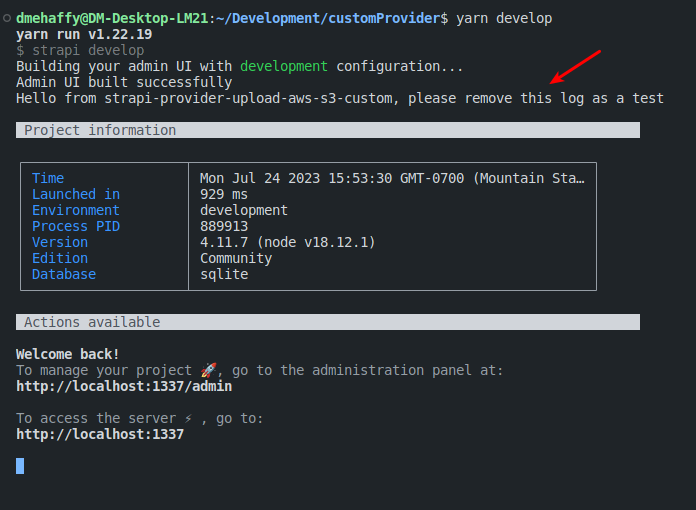

# Custom upload provider (local folder)

In this example we are showing how you can fork one of our official providers into a local directory of your project and use that provider without publishing to npm.

## Code

You can find the plugin code within the [packages directory](./packages/strapi-provider-upload-aws-s3-custom). This code was lightly modified to remove some of the Strapi specific packages and tests and uses typescript.

## Setup

You will need to navigate to the provider directory and install the dependencies and build the provider (since it uses typescript).

```bash
cd packages/strapi-provider-upload-aws-s3-custom
yarn install
yarn build
```

## Usage

You can see in the [package.json](./package.json) that we are calling this provider using npm's built in `file:` method as such:

```json
  "dependencies": {
    "@strapi/strapi": "4.11.7",
    "@strapi/plugin-users-permissions": "4.11.7",
    "@strapi/plugin-i18n": "4.11.7",
    "better-sqlite3": "8.0.1",
    "strapi-provider-upload-aws-s3-custom": "file:packages/strapi-provider-upload-aws-s3-custom"
  },
```

And likewise you can see that we configured the provider in the [plugins config](config/plugins.js)

```js
module.exports = ({ env }) => ({
  // ...
  upload: {
    config: {
      provider: "strapi-provider-upload-aws-s3-custom",
      providerOptions: {
        baseUrl: env("CDN_URL"),
        rootPath: env("CDN_ROOT_PATH"),
        s3Options: {
          accessKeyId: env("AWS_ACCESS_KEY_ID"),
          secretAccessKey: env("AWS_ACCESS_SECRET"),
          region: env("AWS_REGION"),
          params: {
            ACL: env("AWS_ACL", "public-read"),
            signedUrlExpires: env("AWS_SIGNED_URL_EXPIRES", 15 * 60),
            Bucket: env("AWS_BUCKET"),
          },
        },
      },
      actionOptions: {
        upload: {},
        uploadStream: {},
        delete: {},
      },
    },
  },
  // ...
});
```

## Demo

I've added a small bit of code to the provider (in the form of a console.log) to show the custom provider is being loaded. See the example image below and you will see the console.log being printed when the server starts.


